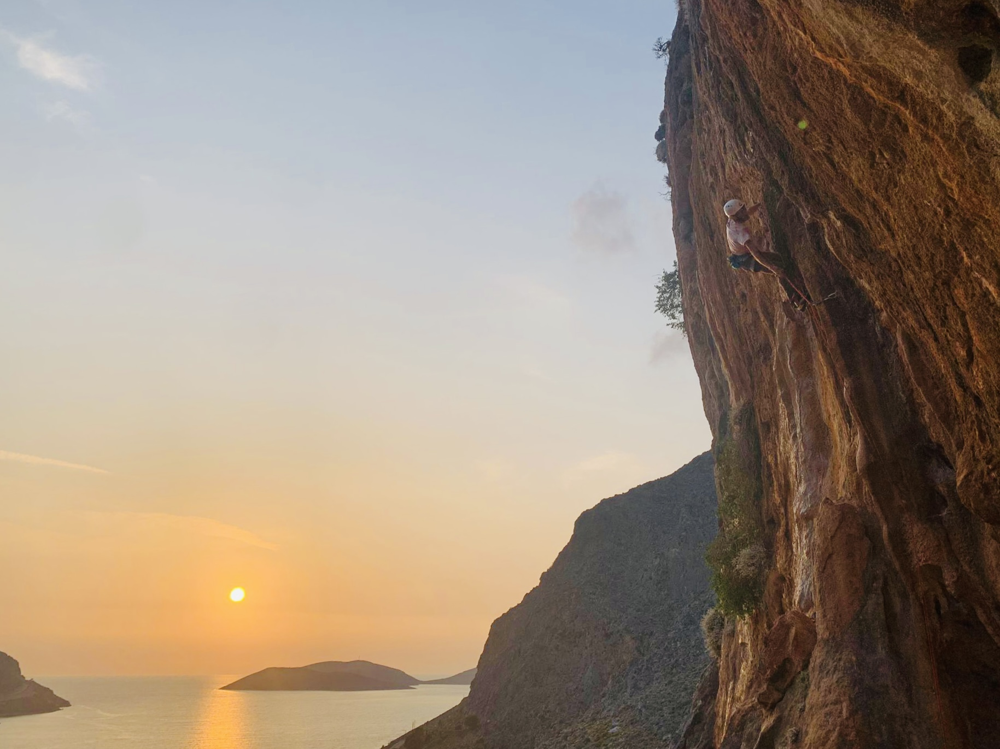

 <h1>  Ethan Partida </h1> 

---

<ul>
 <li><strong>Status</strong>: Mathematics Ph.D. Student</li>
 <li><strong>CV</strong>: <a href="/cv.pdf">February 2025</a></li>
 <li><strong>Email</strong>: ethan_partida [at] brown [dot] edu  </li>
</ul>

## Academics
I'm a fifth year mathematics Ph.D. student at Brown University advised by <a href="https://www.math.brown.edu/mchan2/">Melody Chan</a> and <a href="https://www.dam.brown.edu/people/cklivans/">Caroline Klivans</a>. I am interested in algebraic combinatorics and its connection to algebraic, convex and tropical geometry. Matroids are a recurring character in my research. I am applying for postdoctoral research positions this fall (2026).

Prior, I graduated from the University of Minnesota with BS degrees in mathematics and computer science. 

## Activities
### 2026
* December 9: Speaking at the <a href="https://math.washington.edu/events/series/combinatorics-and-geometry-seminar">University of Washington Combinatorics and Geometry Seminar</a>.
* December 2: Speaking at the <a href="https://math.berkeley.edu/~jyh/combinatorics_seminar_f26.html">UC Berkeley Combinatorics Seminar</a>.
* October 24-25: Attending and speaking at the <a href="https://www.ams.org/meetings/sectional/2333_program_ss13.html#title">Special Session on Algebraic and Geometric Aspects of Matroid Theory</a> at the 2026 AMS Fall Central Sectional Meeting.
* October 20: Speaking at the <a href="https://math.dartmouth.edu/~comb/">Dartmouth Combinatorics Seminar</a>.
* October 9: Speaking at the <a href="https://seminars.math.toronto.edu/pages/seminars">University of Toronto Combinatorics Seminar</a>.
* October 7: Speaking at the <a href="https://sites.google.com/ncsu.edu/algebracombinatoricsseminar/home">North Carolina State University Algebra and Combinatorics Seminar</a>.
* September 28-October 2: Attending and giving a lightning talk at the <a href="https://www.birs.ca/events/2026/5-day-workshops/26w5623">Algebra and Geometry of Matroids Workshop</a> at Casa Matemática Oaxaca.
* September 16: Speaking at the <a href="https://math.mit.edu/combin/">MIT/Harvard Richard P. Stanley Seminar in Combinatorics</a>.
* July 13-17: Presenting a poster at <a href="https://sites.math.washington.edu/fpsac2026/">FPSAC</a> hosted at the University of Washington.
* April 30: Speaking at the <a href="https://pages.uoregon.edu/crowley/combosem/combo-sem.html">University of Oregon Combinatorics Seminar</a>.
* April 22: Speaking at the <a href="https://sites.google.com/view/gocc-combinatorics">Graduate Online Combinatorics Colloquium</a>.
* April 21: Speaking at the <a href="https://mathweb.ucsd.edu/~combosem/combinatorics-seminar.html">UCSD Combinatorics Seminar</a>.
* March 28-29: Organizing the <a href="https://www.ams.org/meetings/sectional/2331_program_ss18.html#title">Special Session on Group Actions and Combinatorics in Algebraic Geometry and Commutative Algebra</a> at the 2026 AMS Spring Eastern Sectional Meeting.
* March 5: Speaking at the <a href="https://combinatoricsseminar.math.umn.edu/">University of Minnesota Combinatorics Seminar</a>.
* March 4: Speaking at the <a href="https://sites.google.com/umn.edu/umn-scas-seminar/home">Univeristy of Minnesota Student Combinatorics and Algebra Seminar</a>.
* Febuary 2: Speaking at the <a href="https://sites.google.com/brown.edu/combo/home">Brown Combinatorics Seminar</a>.
* January 23-25: Attending and speaking at <a href="https://sites.google.com/view/caac26/home?authuser=0">CAAC</a> hosted at Dalhousie University.

## Personal Interests

I like to balance out my mostly stationary academic life by being outdoors as much as possible. As of late this has been through rock climbing and hiking (to rock climbing).

    
    

 
