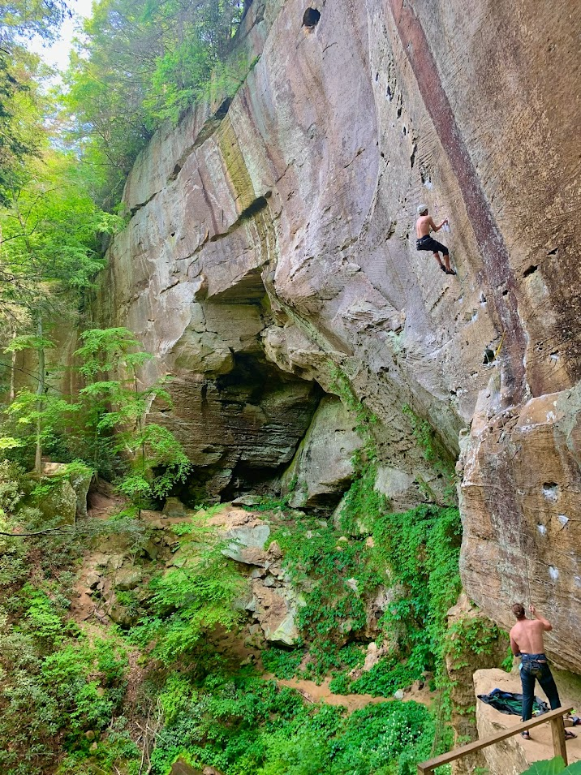

 <h1>  Ethan Partida </h1> 

---

<ul>
 <li><strong>Status</strong>: Graduate Student</li>
 <li><strong>Majors</strong>: Mathematics</li>
 <li><strong>CV</strong>: <a href="/cv.pdf">PDF</a></li>
 <li><strong>Email</strong>: ethan_partida [at] brown [dot] edu  </li>
</ul>

## Academics
I'm  currently a math Ph.D. student at Brown University. I am interested in combinatorics and its connection to algebraic topology. Things I have been interested in lately are: matroids, polytopes and Stanley-Reisner rings.

I also enjoy creating over-engineered solutions to computer *"problems"*. Examples include: a fidget spinner IOT controller, smart mirror, and a terrible machine learning cribbage bot.

Some things I'd like to learn more about are: toric varities, representation theory and geology.
## Personal Interests

I like to balance out my mostly stationary academic life by being outdoors as much as possible. As of late this has been through rock climbing and hiking (to rock climbing).

    
    

 
