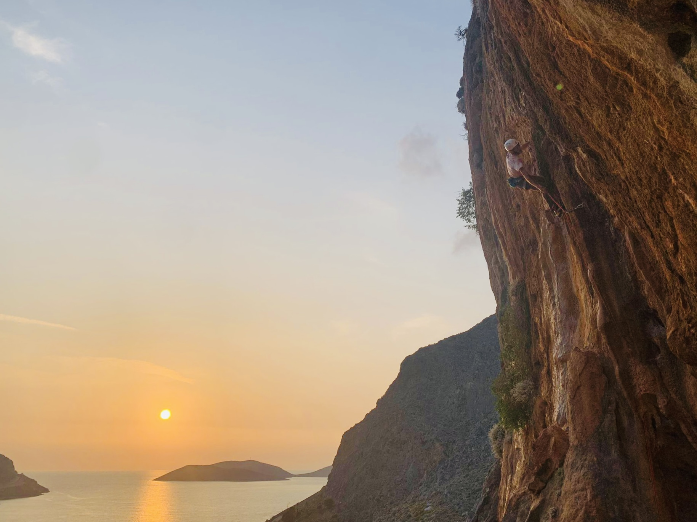

 <h1>  Ethan Partida </h1> 

---

<ul>
 <li><strong>Status</strong>: Mathematics Ph.D. Student</li>
 <li><strong>CV</strong>: <a href="/cv.pdf">June 2023</a></li>
 <li><strong>Email</strong>: ethan_partida [at] brown [dot] edu  </li>
</ul>

## Academics
I'm a second year mathematics Ph.D. student at Brown University advised by <a href="https://www.math.brown.edu/mchan2/">Melody Chan</a> and <a href="https://www.dam.brown.edu/people/cklivans/">Caroline Klivans</a>. I am interested in combinatorics and its connection to algebraic geometry. Things I have been interested in lately are: matroids, shifted simplicial complexes and Stanley--Reisner rings.

Prior, I graduated from the University of Minnesota with BS degrees in mathematics and computer science. 

Some things I'd like to learn more about are: tropical geometry, representation theory and geology.

## Personal Interests

I like to balance out my mostly stationary academic life by being outdoors as much as possible. As of late this has been through rock climbing and hiking (to rock climbing).

    
    

 
